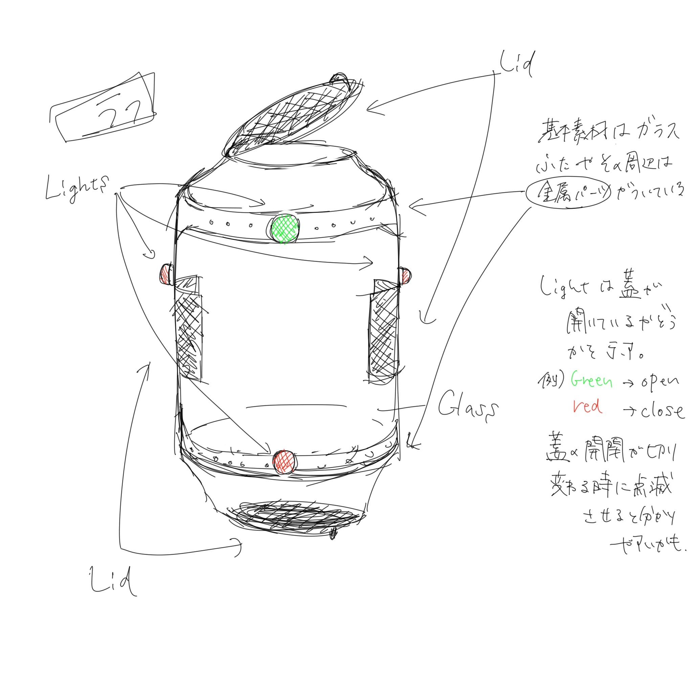
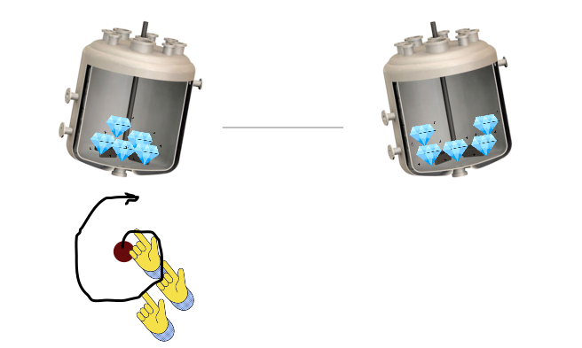

:toc:

= リアクター

リアクターは宝石を入れられて反応を起こすための容器。幅は 1.2 メートルほど。

全体的に丸っこい瓶。見た目は原子炉のようにからくりが複雑そうな感じだが、科学よりもファンタジー寄り。形状も上下左右対称だけど、向きはビジュアルでわかるようにする。

== 蓋

蓋は上下左右が同じで、各々ライトがついている。緑のライトは開いている意味。赤は閉じている。点滅はもうすぐ開閉の意味。

最初は上の蓋だけが開いている状態。以下のように時間が経てば、元々開いていた蓋が閉じ、他の蓋がランダムに一つ開く。**蓋の開閉は同時で行う。**

|===
|レベル（難易度）|時間（秒）
|1|10
|===

WARNING: パラメータはまたあとで調整する

=== 蓋開閉のヒント

蓋が開閉する前に、ヒントが 3 秒間流れる。この間、開閉する蓋のライトは点滅する。サウンドも流れる。

== 回転

=== 操作案1

リアクターの周りを回るように指でなぞると回転できる。

NOTE: 動きが大きすぎて疲れてしまう恐れがある。外で遊べない。また、スクリーンが手で隠れてしまう。

=== 操作案2

スクリーンの下のほうに、回転用のボタンがある。それにタップし、ホールドしたまま、ボタンを中心に回すと回転できる。

=== 回転速度

....
新回転角度 <- 元回転角度 + 回転量 - 回転弾力
回転量 = (指の回転角度 - 元回転角度) * 回転速度比率
回転速度比率 = 0.5 ~ 2.0（適当に入れて調整して）
回転弾力 = 元回転角度 * 回転弾力比率
回転弾力比率 = 0.01 ~ 0.5（適当に入れて調整して）
....

この公式でリアクターが若干遅れて、あとからついてくる効果を実現する。ゴムがついているように回転弾力があるので、同じ方向へと2周ほど回し続けると、力が拮抗してこれ以上回せなくなる。また、回すとき指を離すと、リアクターは元の向きへと巻き戻る。

WARNING: また調整する可能性あり。今の公式だと拮抗すべきところを越えてさらに回せばまだ動く気がする。

=== リセット

蓋が開閉すると、新しく開いた蓋が真上へ向くように、回転角度がリセットされる。
