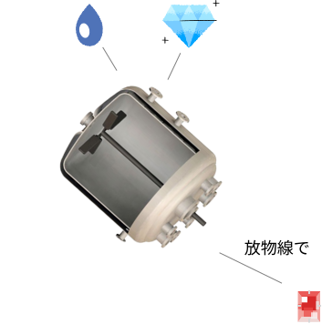
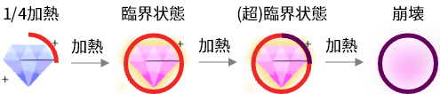

:toc:

= 宝石

プレイヤーは指定された**宝石（Gem）**を錬成するのが目標。

== 投入

宝石と聖水は 5 ~ 10 秒一回に各方向から投げ入れられる。宝石の色はランダム。

|===
|方向|もの|確率
|比較的に上から|低レア度宝石|50%
|比較的に上から|聖水|20%
|比較的に左右から|中レア度宝石|25%
|比較的に下から|高レア度宝石|5%
|===

WARNING: あとで確率はステージによって違う数値にしたい。また、実際に例えば低レア度は 1 か 2 かも調整する。

=== 聖水

一回入れられる聖水の量は適切に調整して。

== 種類と色

レア 3、レア 4 の宝石はその種類の宝石の形をしている。

|===
|種類|色|色コード
|未定|未定|未定
// ||オレンジ|#f79a48
// |エメラルド|緑|#5afa65
// ||青|#79dcf7
// ||紫|#cc84f0
|===

NOTE: 赤緑系色覚異常でも識別できる色にしている。色コードはイメージ。微調整は任せる。

== レア度

宝石のレア度は 4 段階ある。

|===
|レア度|臨界熱量|崩壊熱量|大きさ|形|色
|1|50|110|小さい|角が立っていて割れている石。違う色の宝石でも全く同じ形。|濁っている
|2|100|180|小さめ|丸めの石。違う色の宝石でも全く同じ形。|暗め
|3|200|340|大きい|宝石の形になっているが、1/4欠けている。|普通
|4|500|900|結構大きい|完全に宝石の形。|光ってそう
|===

NOTE: レア度3、4の宝石はちゃんと形になっていることで特別感を出す。具体的な大きさはまず適当に設定してください。あとでプランナーがエディターで調整する。

WARNING: 熱量の数値はテストプレイしたらまた調整したい。大きい宝石と一緒に錬成する宝石がなくて崩壊してしまうこともあるかもしれない。

== 加熱

宝石がリアクターの中に入っていると加熱される。

|===
|状態|毎秒獲得熱量
|リアクターの壁面に接触している|10
|聖水に浸かっている|2
|===

=== 熱量表示

熱量は円環状 UI で表示される。一回りに達すると宝石が臨界状態になる。もう一回りに達すると宝石が崩壊する。

NOTE: 円環状 UI はビジュアル上邪魔になるためよくない。他の方法、例えばアウトラインでも比較的に正確的に表示できるか考える必要がある。

=== 臨界状態

宝石の熱量が臨界熱量に達すると、宝石が臨界状態に入る。臨界状態の宝石は錬成できる。

=== 崩壊

宝石の熱量が崩壊熱量に達すると、宝石が崩壊し消えてなくなる。

== 錬成

聖水に浸かっている、かつ隣接している、かつ臨界状態、かつ同じ色の複数の宝石を指でなぞると、それらを新しい宝石に錬成できる。錬成に使われた宝石は消えてなくなる。

== 特殊効果

未定
